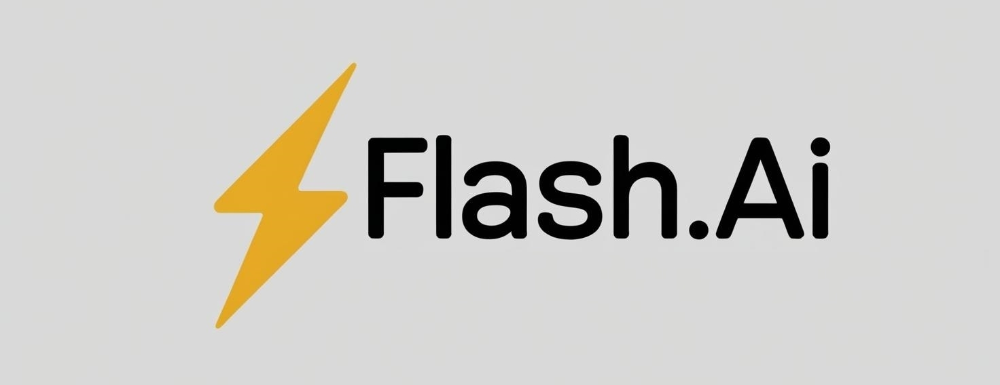

# Flash.Ai

<p align="center">
  
</p>

<p align="center">
  <a href="https://flash-ai-eight.vercel.app/">
    Live Demo
  </a>
</p>

Please note it may take a few seconds to warm up the backend server to actually allow requests to be made.

Tired of spending hours to and from school? Want to make the most out of that time before an exam? Introducing Flash.Ai, your smart study companion, transforming travel time into productive time. Whether it is a bus, train, or carpooling, Flash.Ai helps you go through key concepts, quiz yourself, and build confidence-all hands-free. Ace your exams, wherever you are!

With Flash.Ai, you can upload your notes, study slides, or any other documents to instantly generate AI-powered questions. Quiz yourself on the go, get smarter with every session, and turn your study materials into an interactive learning experience!

# Features

We’ve packed Flash.Ai with powerful features to help you ace your exams effortlessly. Here’s what you get:

- **Secure Accounts** – Register and log in with confidence, protected by JWT authentication and Bcrypt encryption for top-notch security.
- **Anywhere Access** – Upload your files (TXT, PDF, DOC, etc.) to our database and access them anytime, anywhere.
- **AI-Generated Quizzes** – Turn your documents into custom quizzes to test your knowledge on the go, along with a question difficulty system to REALLY test your knowledge.
- **Smart Feedback** – Get instant insights to track your progress and improve.
- **Search & Organize** – Quickly find your documents with a built-in search bar. No more endless scrolling!
- **Mobile-Friendly** – Study seamlessly on any device, whether you're on the bus or at home.
- **Customizable Themes** – Prefer dark mode? Light mode? Switch effortlessly to match your style.
- **Full Account Control** – Easily update your password, email, or username whenever you need

# Tech Stack

[](https://skillicons.dev)

Powered by:

- Google Gemini

# How to Run

Follow the instructions below to build the project or access the [Live Demo](https://flash-ai-eight.vercel.app/)

## Installation

First, you will need Node.JS, and a MongoDB database, along with a Google Generative AI Auth key

Then, you need to clone it to your local machine:

```
git clone https://github.com/Macpickle/Hackathon_Project.git
```

### Backend

First, open a new terminal.

Then, you need to enter the directory containing the backend, and then install all dependencies:

```
cd backend
npm i
```

Following this, you should be able to run the server:

```
npm run start
```

Congratulations! you've just ran our server, there is just one more step, Create a .env file and add the following variables, to your coresponding database, API key, and JWT auth key:

```
MONGODB_URI=YOUR_MONGODB_URI
GOOGLE_AI_API_KEY=YOUR_GOOGLE_AI_API_KEY
JWT_SECRET=YOUR_SECRET_KEY
```

### Frontend

Similar to the backend, you need to open a new terminal and then run these commands to go into the directory, and install all dependencies:

```
cd frontend
npm i
```

Create a .env file and add the following variables:

```
PORT=YOUR_PORT
VITE_NODE_ENV=production/development
VITE_API_URL=YOUR_API_URL
```

Following this, you should be able to run the server:

```
npm run dev
```

Congratulations! you've just ran our frontend! You should be able to interact with our beautiful interface to test it out!

Other useful commands:

```
npm run build
npm run lint
npm run preview
npm run pretty
```

# Developers

[Dylan MacLeod](https://github.com/macpickle) \
[Jack Ma](https://github.com/RZ3M)
